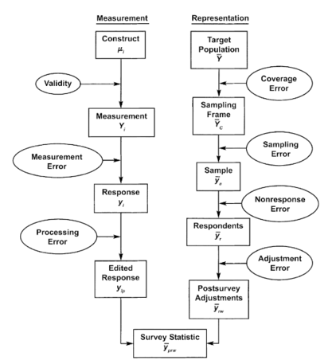
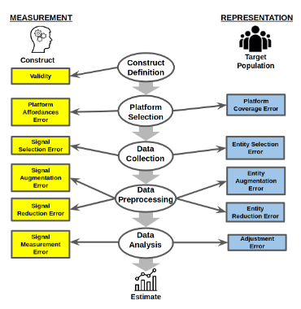

# From the Total Survey Error Framework to an Error Framework for Digital Traces of Humans

A Translation Tutorial at the [ACM conference on Fairness, Accountability, and Transparency (FAT*) 2020](https://fatconference.org/2020/index.html), 27th January, 2020 in Barcelona, Spain. This tutorial will be held at 15:00 hours in MR3 at the [Barcelo Sants Hotel](https://fatconference.org/2020/venue.html).

# Tutorial Materials

Here are the [tutorial slides](https://drive.google.com/file/d/13QjlTEpbtmOHg2jHTCqPO8rz7wyiDyRb/view?usp=sharing).
You may use them in teaching with a [CC-BY-SA 4.0 license](https://creativecommons.org/licenses/by-sa/4.0/deed.ast).
Please attribute the underlying [paper](https://arxiv.org/abs/1907.08228) as:

Sen, I., Floeck, F., Weller, K., Weiss, B., & Wagner, C. (2019). A Total Error Framework for Digital Traces of Humans. arXiv preprint arXiv:1907.08228. (Working paper)

## About 

The activities and interactions of hundreds of millions of people worldwide are recorded as digital traces. These data offer increasingly comprehensive pictures of both individuals and groups on different platforms, but also allow inferences about broader target populations beyond those platforms. Notwithstanding the many advantages, studying the errors that can occur when digital traces are used to learn about humans and social phenomena is essential. Incidentally, many similar errors also affect survey estimates, which survey designers have been addressing for decades using error conceptualization frameworks, most notably the Total Survey Error Framework (TSE). 

TSE                     |  TED
:----------------------:|:-----------------:
  |  

In this tutorial, we will first introduce the audience to the concepts and guidelines of the TSE and how they are applied by survey practitioners in the social sciences, guided by our interdisciplinary background and experience. Second, we will introduce our own conceptual framework to diagnose, under- stand, and avoid errors that may occur in studies that are based on digital traces of humans. Our framework leverages the systematic approach of the TSE and maps its concepts to digital trace settings where applicable. Participants will hence gain insights on (i) how to critically reflect on survey research based on the TSE and (ii) how to translate the recommendations of the TSE to a digital trace setting. 

## Target audience - who may benefit from the tutorial

This tutorial aims to translate expert knowledge from survey methodology that is typically applied in social science research to a broader interdisciplinary community, especially to those researchers who work with behavioral data collected from digital sources. We expect this tutorial to be of interest for participants from a variety of disciplinary backgrounds (e.g. computer science, information science, linguistics, sociology, psychology, political science, demography), particularly those who are interested in leveraging novel forms of digital traces for drawing inferences in areas such as public opinion, healthcare or public policy.

## Prerquisites for attending?

Browse preliminary literature:
- Groves, R. M., & Lyberg, L. (2010). **Total survey error: Past, present, and future.** *Public opinion quarterly, 74(5), 849-879.*
- Sen, I., Flöck, F., Weller, K., Weiss, B., & Wagner, C. (2019). **A Total Error Framework for Digital Traces of Humans.** *arXiv preprint arXiv:1907.08228.*
- Optional: Olteanu, A., Castillo, C., Diaz, F., & Kiciman, E. (2019). **Social data: Biases, methodological pitfalls, and ethical boundaries.** *Frontiers in Big Data, 2, 13.* 

## Planned Timeline

- Introduction and Notation: Surveys and Digital Traces (10 minutes)
- The Total Survey Error Framework (20 minutes)
- An Error Framework for Digital Traces of Humans (30 minutes)
- Applying the Framework: Case Studies and Examples (20 minutes)
- Discussion and Questions (10 minutes)

## Tutorial prepared by (presenters in bold):

**Indira Sen** is a doctoral candidate in Computational Social Science at GESIS, Leibniz Institute for the Social Sciences in Cologne, Germany. She is interested in understanding biases in inferential studies from digital traces, with a focus on natural language processing.

[**Dr. Fabian Flöck**](https://www.gesis.org/en/institute/staff/person/fabian.floeck) is a post-doctoral researcher at the Computational Social Science department at GESIS and team leader of the ‘Data Science’ team. He is interested in open and transparent data science, natural language processing, human computation, and collaborative production processes.

[Dr. Katrin Weller](https://katrinweller.net/) is an information scientist working at the Computational Social Science department at GESIS and team leader of “Social Analytics and Services”. Her research focus is on social media, new types of research data and data preservation, scholarly communication & altmetrics, web users and communication structures. 

[Dr. Bernd Weiß](https://brndwss.uber.space/) is head of the GESIS Panel, a probability-based mixed mode panel, and deputy head of the department Survey Design and Methodology at GESIS, Mannheim. His research interests focus on methods of empirical research in the social sciences (especially, survey methodology, and research synthesis). 

[JProf. Dr. Claudia Wagner](http://claudiawagner.info/) is an assistant professor in Computer Science at University Koblenz-Landau and the interim Scientific Director of the Computational Social Science department at GESIS. Her research focuses on methodological challenges that arise when using digital trace data to build models of human behavior and attitudes and the impact of the digitalization on society and science. 
